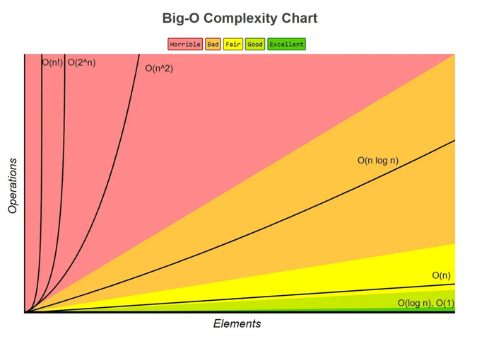

# Data Structures and Algorithms (DSA)
Data Structures and Algorithms (DSA) from zero to mastery is a comprehensive guide to understanding the fundamental concepts of data structures and algorithms. 
This guide is designed for beginners and intermediate learners who want to build a strong foundation in DSA.

## Data Structures
- Data Structures are ways to organize and store data in a computer so that it can be accessed and modified efficiently.
- A data structure is not only used for organizing data but also used for processing, retrieving, and storing data.
- There are different basic and advanced types of data structures.
  - Linear Data Structures
    - Static Data Structures
      - Arrays
    - Dynamic Data Structures
      - Linked Lists
      - Stacks
      - Queues
  - Non-Linear Data Structures
    - Trees
      - Binary Trees
      - Binary Search Trees
      - AVL Trees
      - Red-Black Trees
      - B-Trees
    - Graphs
      - Directed Graphs
      - Undirected Graphs

### Arrays
- An array is a collection of items stored at contiguous memory locations.
- So, if we initialize an array, the elements will be allocated sequentially in memory. This allows for efficient access and manipulation of elements.
- Arrays can be classified in two ways
  - On the basis of Size
    - Static Arrays: Fixed size, allocated at compile time.
    - Dynamic Arrays: Size can change during runtime, allocated at runtime.
  - On the basis of Dimensions
    - One-Dimensional Arrays: A single row or column of elements.
    - Multi-Dimensional Arrays: Arrays with more than one dimension, such as 2D arrays (matrices).

#### Fixed Size Arrays
- We cannot alter or update the size of this array.
- Here only a fixed size (i,e. the size that is mentioned in square brackets []) of memory will be allocated for storage.
- In case, we don't know the size of the array then if we declare a larger size and store a lesser number of elements will result in a wastage of memory.
- or we declare a lesser size than the number of elements then we won't get enough memory to store all the elements. In such cases, static memory allocation is not preferred.
```Java
// Fixed sized array examples
int[] arr1 = new int [5];

// Another way (Array creation and 
// initialization both)
int[] arr2 = {1, 2, 3, 4, 5};
```
```python
# Create a fixed-size list of length 5, 
# initialized with zeros
arr = [0] * 5

# Output the fixed-size list
print(arr)
```

#### Dynamic Arrays
- The size of the array changes as per user requirements during execution of code so we do not have to worry about sizes.
- [ ] TBA


## Algorithms
- An algorithm is a step-by-step procedure or formula for solving a problem.
- Algorithms are used to manipulate data structures.
- Algorithms are essential for solving complex computational problems efficiently and effectively. The provide a systematic approach to.
  - Solving problems: Algorithms break down problems into smaller, manageable steps.
  - Optimizing solutions: Algos find the best or near-optimal solutions to problems.
  - Automating tasks: Algorithms can automate repetitive or complex tasks, saving time and effort.

- Algorithms can be classified into different categories based on their design and application.
- Some common types of algorithms include:
  - Sorting Algorithms
    - Bubble Sort
    - Selection Sort
    - Insertion Sort
    - Merge Sort
    - Quick Sort
  - Searching Algorithms
    - Linear Search
    - Binary Search
  - Graph Algorithms
    - Dijkstra's Algorithm
    - Kruskal's Algorithm
    - Prim's Algorithm
  - Dynamic Programming Algorithms
  - Greedy Algorithms


## Road Map
- Language
  - C++
  - Java
  - Python
  - JavaScript
- DSA Basics and implementation
- Language libraries that support DSA
- Practice


## Analysis of algorithms
- A program can be written in many different ways to solve the same problem.
- Example: Sum of n natural numbers

```python
# using direct formula
def fun(n):
  return n * (n + 1) // 2

## using single loop
def fun(n):
  sum = 0
  for i in range(1, n + 1):
    sum += i
  return sum

## using two loops
## 1 + (1+1) + (1+1+1) + ... + (1+1+...+1) (n times)
def fun(n):
  sum = 0
  for i in range(1, n + 1):
    for j in range(1, i + 1):
      sum += j
  return sum
```

- The question arises which one is better? which one is faster? which one is more efficient?
- To figure this out, we use theories of algorithm analysis which is called "Asymptotic Analysis".
- Asymptotic Analysis
  - Do not depend on machine or compiler
  - Do not depend on programming language
  - Do not depend on the implementation
  - Do not depend on the input data
  - It is about measuring order of growth of the in terms of input size.
- It is about measuring the efficiency of an algorithm in terms of time and space complexity.
- The amount of time and space erquired by an algorithm to run as a function of the input size is called time and space complexity.
- Time Complexity
  - Time complexity is a measure of the amount of time an algorithm takes to complete as a function of the input size.
  - It is expressed using `Big O` notation, which describes the upper bound of the algorithm's growth rate.
  - Common time complexities include:
    - O(1): Constant time
    - O(log n): Logarithmic time
    - O(n): Linear time
    - O(n log n): Linearithmic time
    - O(n^2): Quadratic time
    - O(2^n): Exponential time
- Space Complexity
  - Space complexity is a measure of the amount of memory an algorithm uses as a function of the input size.
  - It is also expressed using `Big O` notation.
  - Common space complexities include:
    - O(1): Constant space
    - O(n): Linear space
    - O(n^2): Quadratic space




- Above example can be analyzed as follows:
  - The first function has a time complexity of O(1) because it uses a direct formula.
  - The second function has a time complexity of O(n) because it uses a single loop.
  - The third function has a time complexity of O(n^2) because it uses two nested loops.
 
## Order Of Growth

